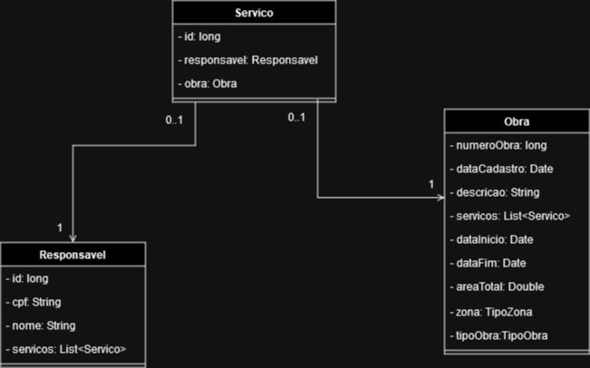

# Desafio Java WEB - Publica

Objetivo do desafio: desenvolver uma solução para o gerenciamento de obras.

Tecnologia utilizada: Springboot versão 2.7.15, com Java versão 11

Gerenciador de dependências: Maven

IDE utilizada: IntelliJ

Aplicado Domain Driven Design e adaptado conforme necessidade do projeto.

## Como rodar o projeto
Para este projeto, foi utilizado o banco de dados relacional PostgreSQL. A aplicação possui configurações de conexão com o banco no arquivo "application.properties":

```
spring.datasource.url = jdbc:postgresql://localhost:5432/obras
spring.datasource.username=postgres
spring.datasource.password=postgres
```

De acordo com a primeira linha, será feita uma conexão com um banco chamado "obras". É necessário, portanto, ter um banco criado no nome "obras". Feito isso, é preciso configurar o login de acesso ao banco, definido nas duas últimas linhas, respectivamente. Se seu usuário e senha diferem, alterar conforme necessidade.

Com o banco configurado, é possível abrir um prompt de comando na pasta do projeto e executar (é necessário ter o maven configurado em suas variáveis de ambiente):

`mvn spring-boot:run`

Ou se estiver abrindo o projeto em uma IDE, executar por um botão disponível.


## Documentação da API

### Para Obras:

#### Lista todas as obras (PÚBLICAS e PRIVADAS) ordenadas pelo número

```http
  GET /obras
```

#### Lista todas as obras de um determinado responsável ordenadas pelo número
```http
  GET /obras/{idResponsavel}
```

| Parâmetro   | Tipo       | Descrição                                   |
| :---------- | :--------- | :------------------------------------------ |
| `idResponsavel`      | `long` | **Obrigatório**. O ID do responsável que você quer listar as obras |


#### Lista apenas as obras públicas cadastradas

```http
  GET /obras/obrasPublicas
```

#### Lista apenas as obras privadas cadastradas

```http
  GET /obras/obrasPrivadas
```

#### Cadastra uma obra privada

```http
  POST /obras/obraPrivada
```

| RequestBody   | Tipo       | Descrição                                   |
| :---------- | :--------- | :------------------------------------------ |
| `criarObraPrivadaDTO`      | `CriarObraPrivadaDTO` | **Obrigatório**. A obra que você deseja cadastrar |

#### Cadastra uma obra pública

```http
  POST /obras/obraPublica
```

| RequestBody   | Tipo       | Descrição                                   |
| :---------- | :--------- | :------------------------------------------ |
| `criarObraPublicaDTO`      | `CriarObraPublicaDTO` | **Obrigatório**. A obra que você deseja cadastrar |


### Para Responsável:

#### Cadastra um responsável

```http
  POST /responsavel
```

| RequestBody   | Tipo       | Descrição                                   |
| :---------- | :--------- | :------------------------------------------ |
| `responsavelDTO`      | `ResponsavelDTO` | **Obrigatório**. O responsável que você deseja cadastrar |


## Como funciona o projeto



* Para cadastrar uma obra com responsáveis, é necessário que estes responsáveis já estejam cadastrados.
* Responsáveis devem ter CPF único.
* Devem ser informados apenas caracteres numéricos no CPF no formato de String.
* Para associar um responsável em um cadastro de obra, é possível apenas informar seu CPF (desde que existente)

Exemplo de cadastro de obra pública:
```
{
    "dataCadastro": "2023-08-18",
    "descricao": "Obra Publica 1",
    "dataInicio": "2023-08-20",
    "dataFim": "2023-09-12",
    "responsaveis": [
        {
            "cpf": "14997895059"
        }
    ]
}
```